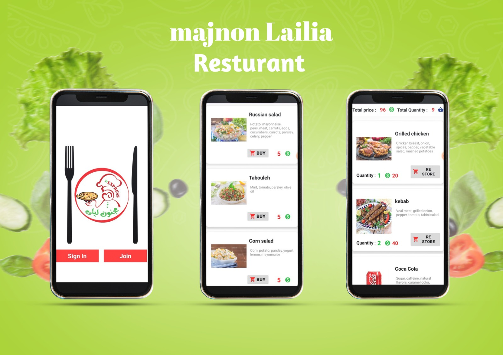

# 🍽️ Restaurant Menu App (Android)
[](LICENSE)

---

## 📱 Overview
An Android application that provides an interactive restaurant menu for users to browse food items categorized into meals, sandwiches, entrees, drinks, and additions. The app allows users to view details about each food item and get a seamless experience for browsing and selecting items.

---

## 🎯 Features
- **Browse Categories**: Meals, Sandwiches, Entrees, Drinks, Additions
- **View Food Details**: Each item has detailed information available.
- **Sold Items View**: Display items that have been purchased.
- **Simple User Authentication**: Users can sign in and join the platform.
- **Clean UI**: Organized categories and interactive layouts using Android XML.

---

## 🔧 Technologies & Techniques Used
- **Android Studio** (Java)
- **Firebase Realtime Database**
- **Firebase Authentication**
- **SQLite Database**
- **RecyclerView**
- **Fragments**
- **Shared Preferences**
- **Intents**
- **Menus**
- **Alert Dialogs**
- **Broadcast Receivers**
- **Services**
- **Web Services**
- **Popup Menus**
- **Swipe Refresh Layout**
- **Material Design UI Components**

---

## 🛠️ Built With
- **Java** – for backend logic
- **XML** – for Android UI layouts
- **Android Studio** – development environment
- **Gradle** – build system

---

## 🚀 Getting Started
To get a local copy of the project running on your machine:
1. **Clone the repo**:
   ```bash
   git clone https://github.com/faresaleemHub/Resturant-Menu.git
2. Open the project in Android Studio and click Open an existing project.
3. Build and run the app either on an emulator or a connected Android device.

---

## 📂 .gitignore
The following file types and directories are ignored in this repository:
*.iml
.gradle/
build/
local.properties
*.log
*.tmp

---

## 📱 App Demo
Here’s a quick preview of the app in action:
### 🖼️ Image Preview


### 🎥 Video Demo
[▶️ Click to watch demo](https://www.youtube.com/watch?v=EHl8-I7jvrk)

---

## 👤 Author
Written with passion by – @FaresSaleemGHub

---

## 📜 License
This project is open-source and available under the MIT License.
